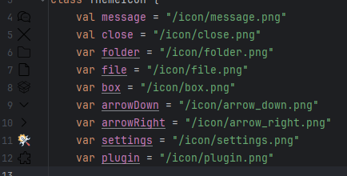

# ComposeTool

## 介绍

- 基于以下插件

| 作用           | 插件                                                                                        | 仓库                                                    |
|--------------|-------------------------------------------------------------------------------------------|-------------------------------------------------------|
| Compose 组件包裹 | [ComposeHelper](https://plugins.jetbrains.com/plugin/18323-compose-helper)                | https://github.com/thelumiereguy/ComposeHelperPlugin  |
| Compose 颜色预览 | [ComposeColorsPreview](https://plugins.jetbrains.com/plugin/21298-compose-colors-preview) | https://github.com/zTrap/compose-color-preview-plugin |

```text
由于插件 ComposeHelper 没有适配新版本idea。所以进行的二次开发, 适配新版本idea.
顺便把一个颜色预览插件也整合进来，可以说是两个插件的合体版.
后面也会扩展一些其他的功能
```

## 扩展功能

- 功能状态
- 开发中: 🍉 已完成: 🆗 不适用: ❌ 考虑中: 🍎

| 功能     | 完成 |
|--------|----|
| 资源图片显示 | 🆗 |
| 模板目录   | 🍎 |

## 演示
### 资源图片显示
- 资源图片在装订线显示，并可以直接点击跳转到图片文件
